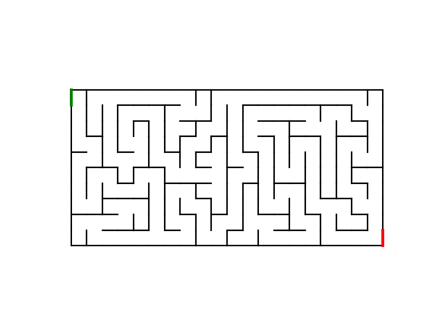
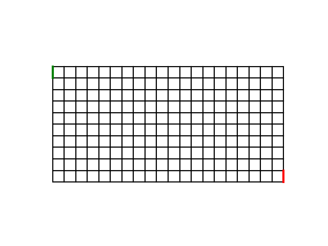

# maze-generator-solver

<i>A procedural maze generator and solver with animated visualization using graph traversal algorithms.</i>

This project generates perfect mazes using Depth-First Search (DFS) and Prim’s algorithm, then solves them using Breadth-First Search (BFS). Both generation and solving can be visualized step-by-step and exported as GIF animations.

<p align="center">    </p>

## Features
- Maze generation using:
   - Depth-First Search (DFS) backtracking
   - Randomized Prim’s algorithm
- Guaranteed perfect mazes (one unique path between any two cells)
- Maze solving using Breadth-First Search (BFS)
- Step-by-step generation and solving animations
- Red path highlighting for solution visualization
- GIF export for both generation and solving
- Adaptive animation speed based on maze size

## Installation
### Requirements
- **Python 3.10 — 3.12** recommended
- **pip** installed

### 1.  Clone the repo
   ```sh
   git clone https://github.com/jmagali/maze-generator-solver.git
   cd maze-generator-solver
   ```

### 2.  Install the required Python libraries
   ```sh
   pip install -r requirements.txt # This installs the required libraries
   ```

### 3.  Run the program
   ```sh
   python main.py
   ```
