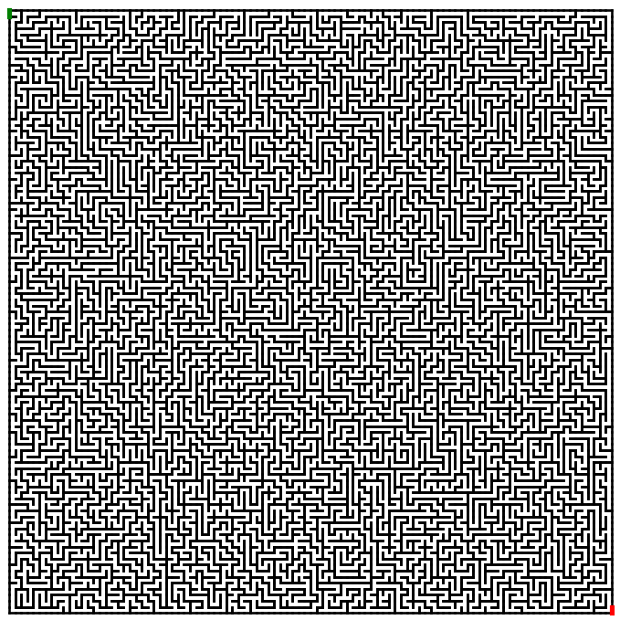
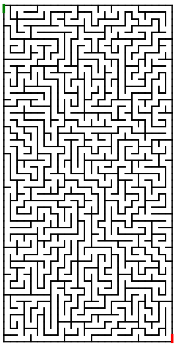
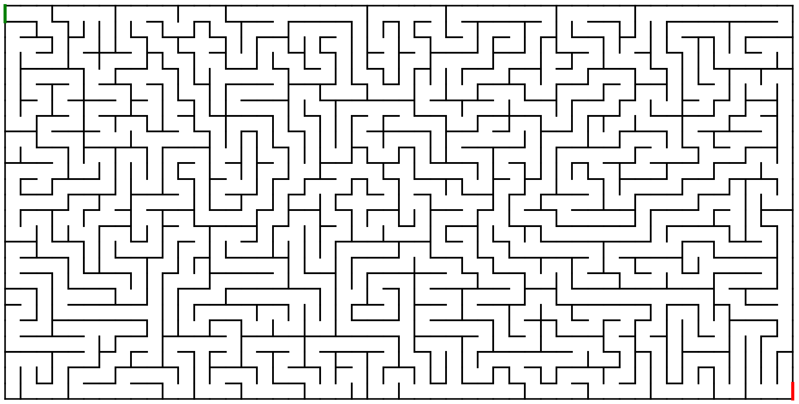

# maze-generator-solver

<i>A procedural maze generation project using depth-first search and backtracking.</i>

Generate clean, randomized mazes using classic graph traversal algorithms.

This project builds a grid-based maze by carving paths between cells, ensuring a fully connected structure with no isolated regions. The result is a perfect maze — one with exactly one path between any two points.

<p align="center">  </p> <p align="center">  </p> <p align="center">  </p>

## Installation
### Requirements
- **Python 3.10 — 3.12** recommended
- **pip** installed

### 1.  Clone the repo
   ```sh
   git clone https://github.com/jmagali/maze-generator-solver.git
   cd maze-generator-solver
   ```

### 2.  Install the required Python libraries
   ```sh
   pip install -r requirements.txt # This installs the required libraries
   ```

### 3.  Run the program
   ```sh
   python main.py
   ```
